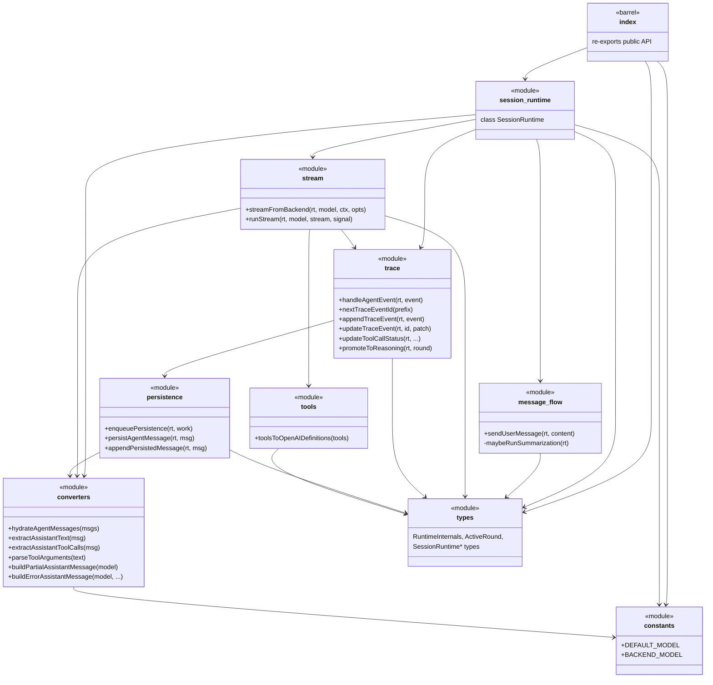
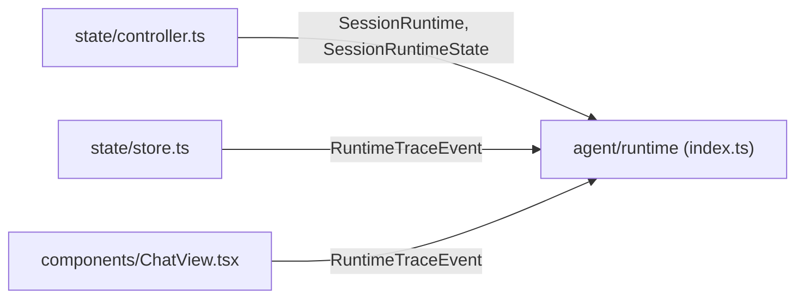

# Agent Runtime — Architecture

Class and relationship diagram for `src/renderer/agent/runtime/` after the
sliced/layered refactor. `SessionRuntime` owns all mutable state and exposes it
to the feature modules through the internal `RuntimeInternals` contract; the
conversational loop is split across function modules by responsibility.

## Class diagram

```mermaid
classDiagram
    direction LR

    class RuntimeInternals {
        <<interface>>
        +input: SessionRuntimeInput
        +tools: AgentTool[]
        +agent: Agent
        +persistedMessageIds: Set~string~
        +state: SessionRuntimeState
        +model: string
        +inflightAbort: AbortController
        +currentTurnUserText: string
        +persistenceChain: Promise
        +activeRound: ActiveRound
        +roundIndex: number
        +currentTurnToolResults: EphemeralToolResult[]
        +notify() void
    }

    class SessionRuntime {
        -listeners: Set~RuntimeListener~
        -agentEventUnsubscribe: () void
        +constructor(input)
        +subscribe(listener) () void
        +getState() SessionRuntimeState
        +getToolNames() string[]
        +sendUserMessage(content) Promise
        +abort() void
        +dispose() void
        +clearTrace() void
        +replaceSummaries(summaries) void
        +notify() void
    }

    class SessionRuntimeState {
        <<type>>
        +messages: Message[]
        +summaries: Summary[]
        +streamingFinalText: string
        +trace: RuntimeTraceEvent[]
        +isStreaming: boolean
    }

    class SessionRuntimeInput {
        <<type>>
        +sessionId: string
        +scope: WorkspaceScope
        +profile: Profile
        +project: Project
        +agent: AgentRecord
        +messages: Message[]
        +summaries: Summary[]
        +toolActions: WorkspaceToolActions
        +model?: string
    }

    class RuntimeTraceEvent {
        <<union type>>
        reasoning | tool_call
    }

    class ActiveRound {
        <<type>>
        +index: number
        +textBuffer: string
        +hasToolCalls: boolean
        +reasoningEventId: string
        +toolCallEventIds: Map
    }

    class RuntimeListener {
        <<type>>
        (state) void
    }

    SessionRuntime ..|> RuntimeInternals : implements
    SessionRuntime *-- SessionRuntimeState : owns
    SessionRuntime o-- SessionRuntimeInput : constructed with
    SessionRuntime o-- RuntimeListener : notifies
    SessionRuntimeState *-- RuntimeTraceEvent : trace[]
    RuntimeInternals ..> ActiveRound : activeRound
    RuntimeInternals ..> SessionRuntimeState : state
```

## Module dependency diagram

Feature modules are stateless functions that receive the runtime through the
`RuntimeInternals` contract. Arrows point from caller to callee.



## External consumers


